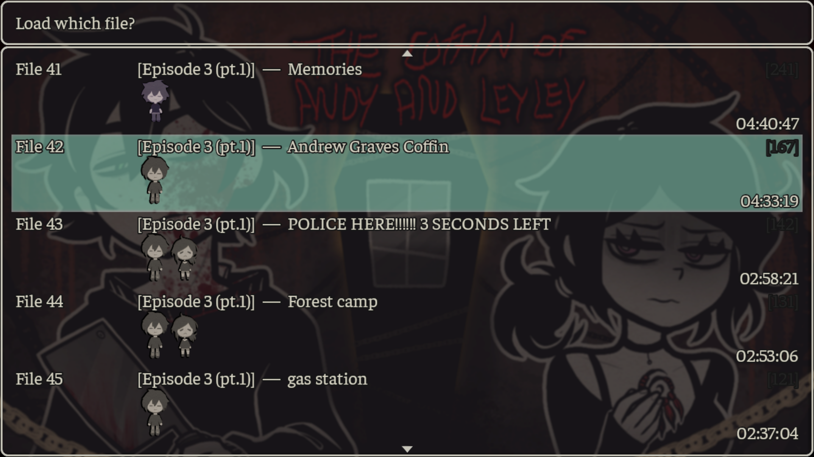

# BetterSaves — мод на улучшенные сохранения

**Мод для игры [The Coffin of Andy and Leyley](https://store.steampowered.com/app/2378900)**



## Что добавляет

- **Метка эпизода** на каждом слоте — Эпизод 1, 2, 3 (ч.1), 4
- **Заметки** — добавляй текст к каждому сохранению ("выбор в машине", "тру энд" и т.д.)
- **Редактирование заметки** без перезаписи сохранения
- **Копирование слотов** — дублируй сохранение в любой слот
- **Удаление** сохранений прямо из меню
- **Язык** переключается в настройках игры (RU / EN)
- Старые сохранения **не ломаются** — эпизод определяется автоматически при первом запуске

---

## Установка

### Windows

1. [Скачай последний релиз](../../releases/latest) и распакуй в любую папку
2. Запусти `install.bat`
3. Запускай игру через Steam как обычно ✓

### Linux

1. [Скачай последний релиз](../../releases/latest) и распакуй
2. Открой терминал в папке с архивом
3. Выполни:
   ```bash
   chmod +x install.sh && ./install.sh
   ```
4. Запускай игру через Steam как обычно ✓

---

## Удаление

Запусти `uninstall.bat` (Windows) или `uninstall.sh` (Linux).  
Все твои сохранения останутся нетронутыми.

---

## Смена языка

`Настройки` → пункт **"Язык мода сейвов"** → нажми Enter или ←/→

---

## Совместимость

| | |
|---|---|
| Windows | ✅ |
| Linux | ✅ |
| macOS | ✅ (через install.sh) |
| Версия игры | 3.0.x и выше |
| Существующие сохранения | ✅ не ломаются |

---

## Если автоматическая установка не помогла

1. Скачайте BetterSaves.js файл
2. Поместите его в /The Coffin of Andy and Leyley/www/js/plugins
3. Запускайте игру через Steam
---
## Нашёл баг?

В меню загрузки нажми на сохранение → **"Репорт ошибки"** — данные скопируются в буфер.  
Открой [Issue](../../issues/new) и вставь скопированный текст с описанием проблемы.

---

## Авторы

- **PA3MA3AH** — разработка
